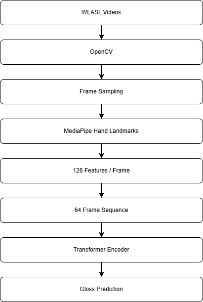

# ASL Word Recognition using Transformers

## Overview

End-to-end American Sign Language (ASL) word recognition system built using the WLASL dataset, MediaPipe hand landmarks, and a Transformer-based classifier.

## Features

* Processed 10,000 videos from WLASL
* Extracted hand landmarks using MediaPipe
* Multiprocessing-based extraction pipeline
* Transformer encoder for sequence classification
* Supports 1,998 ASL gloss classes

## Pipeline

Video
→ OpenCV Frame Extraction
→ MediaPipe Hand Landmarks
→ 126-Dimensional Features
→ 64-Frame Sequence
→ Transformer Encoder
→ Gloss Prediction

## Dataset

* Source: WLASL
* Videos Processed: 10,000
* Classes Covered: 1,998
* Sequence Length: 64 Frames
* Features per Frame: 126

Final Dataset Shapes:

* X: (10000, 64, 126)
* y: (10000,)

## Model

Transformer Encoder

* 4 Encoder Blocks
* 8 Attention Heads
* Embedding Dimension: 512

## Results

* Training Accuracy: ~9%
* Validation Accuracy: ~1%
* Training Loss: ~4.49
* Validation Loss: ~6.63

Random baseline for 1,998 classes is approximately 0.05%, indicating the model learned meaningful patterns despite limited samples per class.

## Project Structure

ASL_word_recognition/
│
├── README.md
├── requirements.txt
├── .gitignore
│
├── assets/
│
├── data/
│   ├── extraction_metadata.json
│   ├── failed_videos.json
│   ├── gloss_to_label.json
│   ├── label_to_gloss.json
│   ├── idx_to_label.json
│   ├── sampled_manifest.csv
│   ├── manifest.csv
│   ├── missing.txt
│   ├── nslt_100.json
│   ├── nslt_300.json
│   ├── nslt_1000.json
│   ├── nslt_2000.json
│   ├── wlasl_class_list.txt
│   └── WLASL_v0.3.json
│
├── models/
│   └── hand_landmarker.task
│
├── notebooks/
│   ├── data_exp.ipynb
│   ├── landmark_extraction.ipynb
│   ├── transformer_proto.ipynb
│   └── transformer_v2.ipynb
│
└── scripts/
    └── extract_10k.py

## Installation

pip install -r requirements.txt

## Future Work

* Data augmentation
* Top-K class experiments
* Real-time webcam inference
* Larger transformer architectures
* Better class balancing strategies

## Acknowledgements

* WLASL Dataset
* MediaPipe
* TensorFlow
